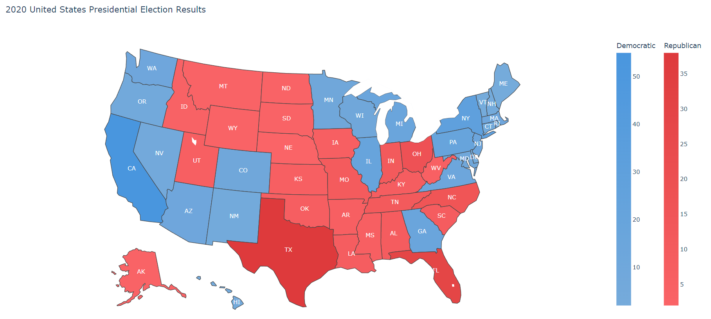

# Portfolio

#### Technical Skills: Python, C#, C++, SQL

## Education
- B.S., Physics | University of Pretoria (_Current_)

## Projects
### [2020 United States Presidential Election Results Interactive Cloropleth Map](2020_usa_presidential_election_results.md)
- Developed an interactive electoral college map visualizing the 2020 U.S. Presidential Election results using Python and Plotly Express.
- Extracted election results from Wikipedia and processed the data.
- Created choropleth maps representing Democratic and Republican electoral votes with distinct color scales.
- Implemented interactivity and added state abbreviations for clarity.

